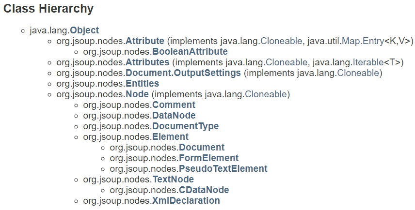

# 一、课表分析

##  1、html课程信息分析

```yaml
form: id=Form1
	select: id="zc"
    	option: value=""
    	...
    select: id="xnxq01id" 
    	option: value=""
	table: id=kbtable
		tr 星期信息 
			th 空
			th 星期
			...
        tr 课程信息
        	th 节数信息
        	th 课程
        		div: class="kbcontent"
        			大学英语Ⅳ
        			font: title="老师"
        				老师名字
        			font: title="周次(节次)"
        				周次
                    font: title="教室"
                    	教室
        ...
```

## 2、提交表单信息分析

```yaml
FORM: name=Form1 
    cj0701id=
    	input: name=cj0701id
    zc=1 第几周
    	select: name=zc
    demo=
    xnxq01id=2019-2020-2 第几学期
    	select: name=xnxq01id
    sfFD=1 是否放大
    	input: type="checkbox" name="sfFD" value="1"
    jx0415zbdiv_1=2AF98A445C4E4077989B969CD983AF2D-1-1
    jx0415zbdiv_2=2AF98A445C4E4077989B969CD983AF2D-1-...
        table
            td
            input: name="jx0415zbdiv_1",value="2AF98A445C4E4077989B969CD983AF2D-1-1"
```

# 二、Jsuop

##  资料

 [jsoup资料一](https://www.javatpoint.com/jsoup-tutorial)

 [jsoup资料二](https://www.open-open.com/jsoup/)

## 1、简介

### API

包：

* `org.jsoup`
* `org.jsoup.examples`
* `org.jsoup.helper`
* `org.jsoup.nodes`
* `org.jsoup.parser`
* `org.jsoup.safety`
* `org.jsoup.salect`

`org.jsoup.nodes`包：



主要类：

* `Jsoup`

> provides methods to connect, clean and parse the HTML document.


> jsoup能将糟糕的html格式解析，这是优点之一。

* Document`

> 一个文档的对象模型，由多个Elements和TextNodes组成

* `Element`

> 一个Element包含一个子节点集合，并拥有一个父Element。还提供了一个唯一的子元素过滤列表。

### 数据获取


栗子：

```java
public class JSoupTest {
    @Test
    public void test() throws IOException {
        String flieNmae=JSoupTest.class.getClassLoader().getResource("class_schedule.txt").getPath();
        File file=new File(flieNmae);
        Document document=Jsoup.parse(file,"utf-8");
        final Element form = document.getElementById("Form1");
        final Element table = form.getElementById("kbtable");
        final Elements classes = table.getElementsByClass("kbcontent");
        for (Element element:
             classes) {
            final String text = element.text();
            if ("".equals(text.trim())){
                continue;
            }
            System.out.println(text);
        }
    }
}
/*
    大学英语Ⅳ 王梓璇讲师 1-17(周) 7－202
    计算机组成原理及汇编语言 陆寄远教授 1-17(周) 北教B203
    大学英语Ⅳ 王梓璇讲师 1-17(周) 7－202
    平面动画制作 路明 1-17(周) 实验楼1101
    Python程序设计 李立其他 1-17(周) 实验楼1101
    计算机组成原理及汇编语言 陆寄远教授 1-17(周) 实验楼401
    ......
*/
```

### 其他知识点

* `Selector`选择器，`Document`、`Element`、`Elements`的 `select()`方法。

*  消除不受信任的HTML，`Jsoup`的`clean()`方法。

## 2、实战

获取课表页面中的课程信息、课程表单中参数信息。

#### 代码

```java
//cn.test.HTMLParser
```

#### 结果

```json
{
    "第一大节": [
        "大学英语Ⅳ 王梓璇讲师 1-17(周) 7－202", 
        "计算机组成原理及汇编语言 陆寄远教授 1-17(周) 北教B203", 
        "大学英语Ⅳ 王梓璇讲师 1-17(周) 7－202", 
        "平面动画制作 路明 1-17(周) 实验楼1101", 
        "Python程序设计 李立其他 1-17(周) 实验楼1101", 
        "", 
        ""
    ], 
    "备注": [
        "XML基础 何志良 1-17周;平面动画制作 路明 1-17周"
    ], 
    ......
}
[
    jx0415zbdiv_1=2AF98A445C4E4077989B969CD983AF2D-1-1, 					 
    jx0415zbdiv_2=2AF98A445C4E4077989B969CD983AF2D-1-2,
    .......
]

```

